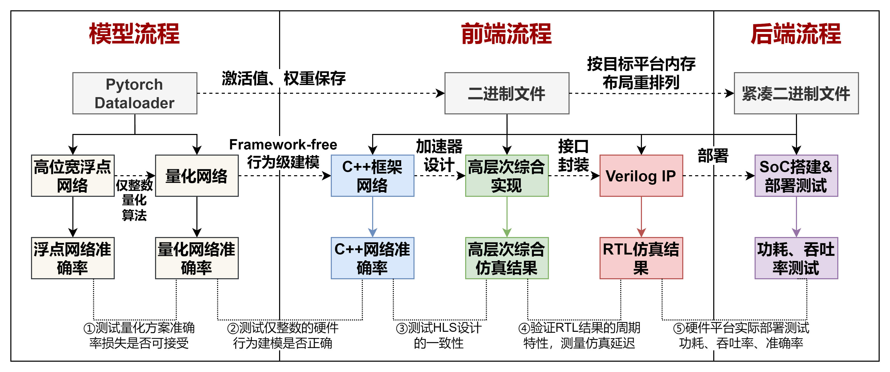
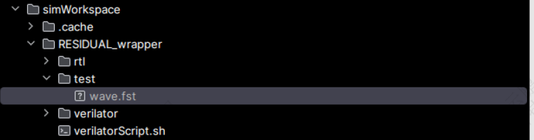
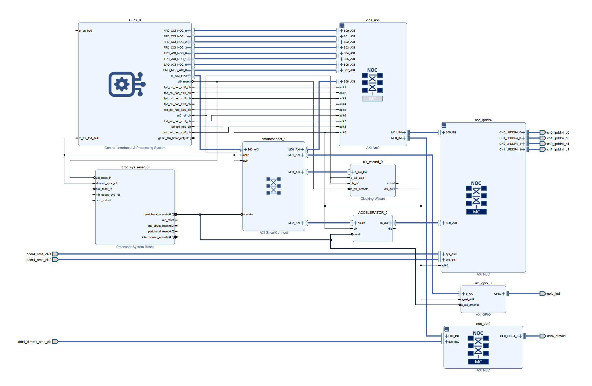
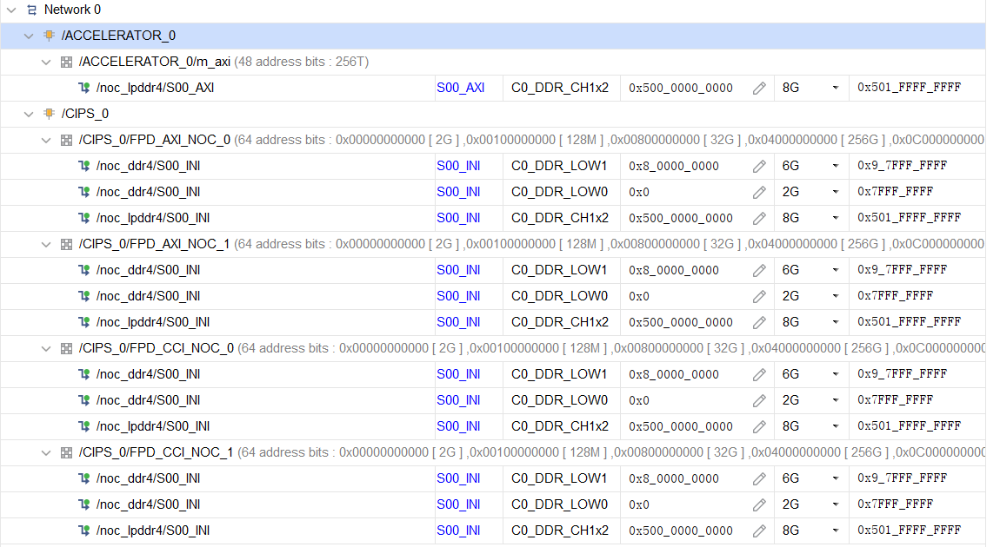
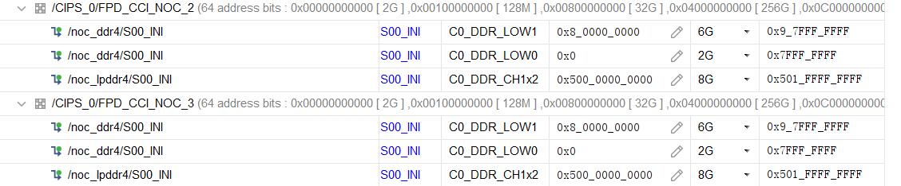
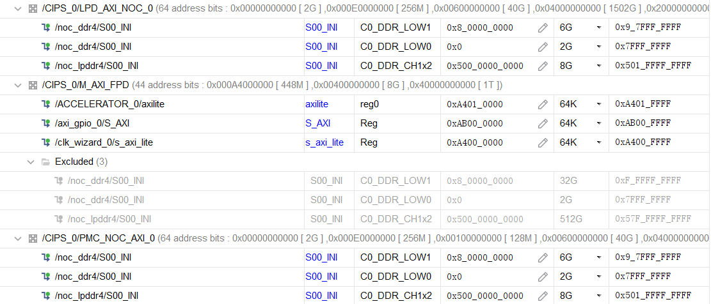
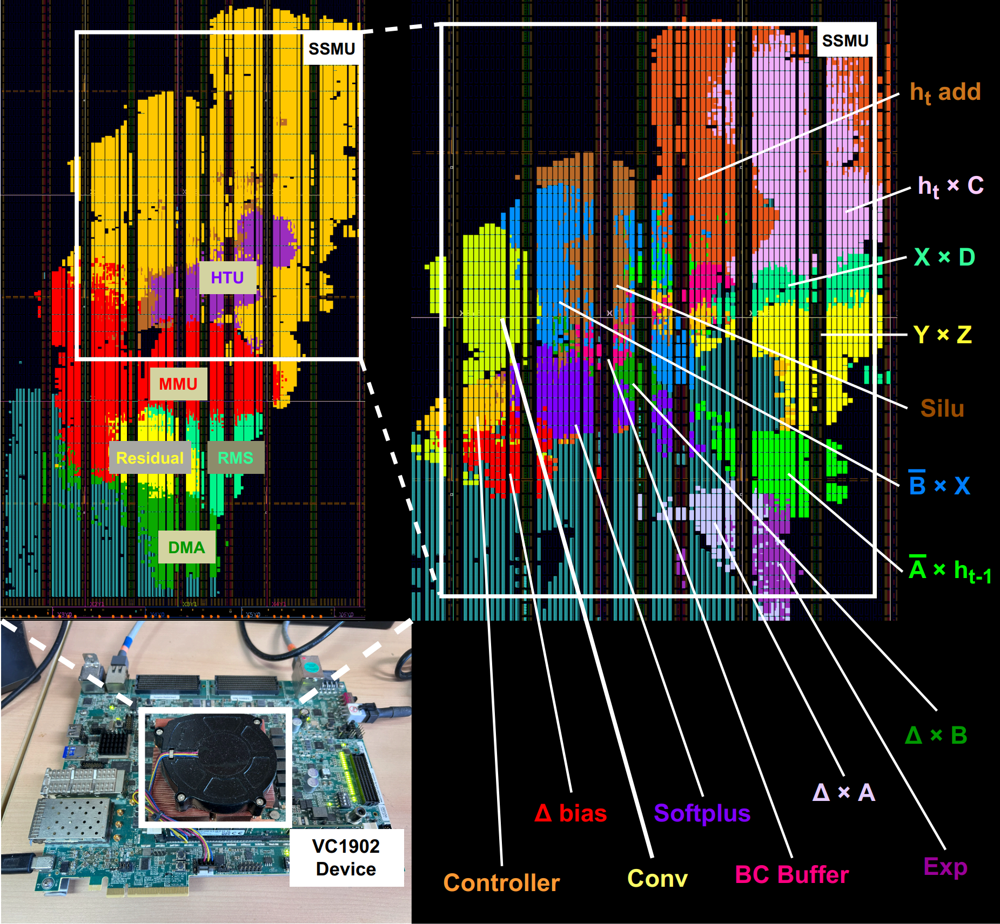

# Light Mamba 

LightMamba是文章《LightMamba: Efficient Mamba Acceleration on FPGA with Quantization and Hardware Co-design》的官方开源实现，是一个基于FPGA硬件平台的mamba模型加速器。



该加速器设计流程包含3个部分，分别为模型流程，前端流程和后端流程。模型流程在Pytorch框架下完成，前端流程使用Vitis HLS和SpinalHDL完成，后端流程使用Vivado和Pynq完成。前端流程为加速器设计流程，首先为C++框架设计，在无机器学习框架的前提下，使用C++完成网络算子的建模，再次验证神经网络量化的一致性，同时其成为HLS设计的参考设计。其次为高层次综合实现，对各个算子分别设计硬件模块，数据以在多个模块间以AxiStream接口进行数据串流。在HLS框架下完成各个算子的前仿真（C++功能仿真）和综合，综合得到的Verilog文件在SpinalHDL中进行打包和仿真。仿真通过后进入后端流程，移植Pynq框架，并部署加速器进行测试。

## 1. 加速器特性

以下特性针对VCK190:

| Precision | LUTs | DSPs | BRAMs | Frequency |   prefill   |
| :-------: | :--: | :--: | :---: | :-------: | :---------: |
|   W4A4    | 107k | 228  |  456  |  400MHz   | 7.21  tok/s |


## 2. 开发环境

- Vitis HLS2023.2及以上

- python3
- IDEA （Community）+ Scala（2.11.12） + Spinal（1.7.1）+ Verilator（5.x）

## 3. 项目文件结构

该项目包含几个组件：

- HLS设计文件
- 用于运行Vitis HLS的Python脚本
- 用于加速仿真和打包导出的SpinalHDL代码
- 用于在FPGA上测试的jupyter notebook脚本

```shell

LIGHT-MAMBA/
├── src/                    # HLS设计头文件
├── case/                   # 包含HLS算子模块组件，以及组件的单元测试
│   ├── refs.7z             # 神经网络权重数据压缩包，需解压
│   ├── ATTN.cpp.template   
│   ├── MLP.cpp.template     
│   ├── SOFTMAX_1X2.cpp      
│   ├── GELU.cpp             
│   └── ...                 
├── instances/             	    # 自动生成的文件夹，Vitis HLS生成的算子组件ip
│   ├── proj_B_BUFFER 	    
│   ├── proj_B_BUFFER          
│   ├── proj_CONV        	 
│   ├── ...                 
│   ├── proj_GEMM           
│   ├── proj_GEMM_MUX          
│   ├── ...                  
│   └── proj_SILU     
├── mamba_cpp/				# mamba网络使用C++语言建模  
├── ips/					# 自动生成的文件夹，Vitis HLS生成的算子组件ip
├── SPINAl/                 # 用于快速仿真加速器、打包到Vivado环境的代码
│   └── ...                 # ...
├── pynq/               	# 用于在板上测试加速器的jupyter notebook脚本
├── bin/ 					# weight以及激活函数查找表数值 
├── constant.py             # 包含常量定义的Python文件
├── pre_syn_process.py      # 创建VitisHLS项目的Python脚本
├── pst_syn_process.py      # 收集HLS综合数据并支持其他流程的Python脚本
├── step0_~step5.py         # 整个流程需要执行的Python脚本
├── memba_bd.tcl      		# 用于创建VCK190基础Block Design的TCL脚本
└── template.tcl            # 用于生成各个HLS项目的模板文件
```


## 4. 开发流程

该项目的开发流程主要有以下步骤：

### 4.1 HLS Simulation

进行仿真之前，需要更改权值、查找表文件目录。在step1_hls_sim.py脚本中选择需要仿真的模块,比如RESIDUAL模块。

```python
case_names = [
	...
    ...
    # "EXP",
    # "GEMM_DEMUX",
    # "GEMM_MUX",
    # "GEMM",
    # "HT_ADD_QUANT",
    # "HT_ADD",
    # "HT_STATE",
    # "HTC_QUANT",
    # "HTC",
    # "M_AXI_FLOW",
    # "M_AXI_STATIC",
    # "QUANT_CONV",
    "RESIDUAL",
	...
    ...
    ...
]
```


选择要仿真的算子模块之后，在终端运行：

```shell
python step1_hls_sim.py
```

运行结果如下（仿真结果终端有输出，也可查看运行log）：

```shell
RESIDUAL is running
....
....
....
    
[X                   ][==================================================] 100%  Estimated total time: 0s, Estimated remaining time: 0s
[CONDENSED OD        ][==================================================] 100%  Estimated total time: 0s, Estimated remaining time: 0s
[Y                   ][==================================================] 100%  Estimated total time: 0s, Estimated remaining time: 0s
[RESIDUAL O          ][==================================================] 100%  Estimated total time: 0s, Estimated remaining time: 0s
[X                   ][==================================================] 100%  Estimated total time: 0s, Estimated remaining time: 0s
[CONDENSED OD        ][==================================================] 100%  Estimated total time: 0s, Estimated remaining time: 0s
[Y                   ][==================================================] 100%  Estimated total time: 0s, Estimated remaining time: 0s
[RESIDUAL O          ][==================================================] 100%  Estimated total time: 0s, Estimated remaining time: 0s
INFO [HLS SIM]: The maximum depth reached by any hls::stream() instance in the design is 320
INFO: [SIM 211-1] CSim done with 0 errors.
INFO: [SIM 211-3] *************** CSIM finish ***************
INFO: [HLS 200-2161] Finished Command csim_design Elapsed time: 00:00:03; Allocated memory: 0.000 MB.
INFO: [HLS 200-112] Total CPU user time: 6.45 seconds. Total CPU system time: 0.77 seconds. Total elapsed time: 7.36 seconds; peak allocated memory: 641.383 MB.
RESIDUAL is done, time: 9.075169324874878
```

### 4.2 HLS Synthesis

算子模块进行综合时，可对其综合属性进行配置(step2_hls_syn.py)：

```python
create_tcls(INSTANCE_DIR, case_names=case_names, do_csim=False, do_csynth=True, do_cosim=False,do_syn=True, do_impl=True, phys_opt="all", pipeline_style="frp")
```

选择需要综合的模块，比如RESIDUAL模块(step2_hls_syn.py)：

```python
case_names = [
    ...
    ...
    ...
    # "M_AXI_STATIC",
    # "QUANT_CONV",
    "RESIDUAL",
    # "RMSNORM_1",
	...
    ...
]
```

运行综合脚本step2_hls_syn.py，所有模块综合结束后，运行step5_print_resource.py可以查看资源占用情况：

```shell
python step2_hls_syn.py

python step5_print_resource.py
```

```shell
instance         SLICE     LUT       FF        DSP       BRAM      URAM      LATCH     SRL       CP        

proj_DTA         0         1643      1708      8         32        0         0         3         1.957     
proj_DBU         0         1341      937       8         3         0         0         4         2.236     
proj_DTB         0         1044      917       8         0         0         0         2         2.099 
...
proj_DTB_QUANT   0         3532      3427      8         0         0         0         416       2.099     
proj_C_BUFFER    0         388       518       0         0         0         0         0         1.469     
proj_DAH         0         1211      1019      8         0         0         0         74        2.027 
...
```


### 4.3  SpinalHDL Simulation and Packaging

通过使用SpinalHDL，我们提供了一个使用Verilator仿真的平台，以提供整个加速器的完整仿真，提升仿真速度。运行step3_spinal_flow.py脚本，将生成的各个项目的verilog代码复制到SPINAL目录下，并且并行运行所有层的仿真。 为了使用SpinalHLD，需要使用Jetbrains的IDEA环境并且安装Scala插件。 请遵循SpinalHDL的官方文档安装环境兼容的Verilator ([https://spinalhdl.github.io/SpinalDoc-RTD/SpinalHDL/Getting%20Started/](https://spinalhdl.github.io/SpinalDoc-RTD/v1.3.1/SpinalHDL/Simulation/install.html))。*Note: 我们使用的是oss cad suit*

要启用 SpinalSim，必须在 build.sbt 文件中添加以下行：

```shell
fork := true
```

 在IDEA中打开SPINAL目录，加载build.sbt文件以启动SpinalHDL的仿真：

```shell
sbt run
```

仿真启动之后会出现如下界面：

```shell
[info] welcome to sbt 1.10.0 (Ubuntu Java 17.0.15)
[info] loading project definition from <***>/light-mamba-master/SPINAL/project
[info] loading settings for project root from build.sbt ...
[info] set current project to SPINAL (in build file:<***>light-mamba-master/SPINAL/)

Multiple main classes detected. Select one to run:
 [1] accelerator_save_conv_mem
 [2] accelerator_save_mem
 [3] generate_accelerator
 [4] generate_mamba
 [5] simulate_B_buffer
 [6] simulate_C_buffer
 [7] simulate_accelerator
 [8] simulate_conv
 [9] simulate_conv_state
 [10] simulate_dAh
 [11] simulate_dBu
 [12] simulate_dtA
 [13] simulate_dtB_quant
 [14] simulate_dtadapt
 [15] simulate_exp_quant
 [16] simulate_gemm
 [17] simulate_gemm_demux
 [18] simulate_gemm_mux
 [19] simulate_htC_quant
 [20] simulate_ht_add_quant
 [21] simulate_ht_state
 [22] simulate_m_axi
 [23] simulate_mamba
 [24] simulate_quant_conv
 [25] simulate_residual
 [26] simulate_rmsnorm_quant_1
 [27] simulate_rmsnorm_quant_2
 [28] simulate_silu_demux
 [29] simulate_silu_mux
 [30] simulate_silu_quant
 [31] simulate_simple_node
 [32] simulate_uD
 [33] simulate_yz
 [34] utils.genManager
 [35] utils.simulate_controller

Enter number: 25

  | => root / Compile / selectMainClass 13s

```

以residual为例，选择该模块之后，运行完仿真，会有success标识；会生成对应的文件夹及波形文件：

```shell
  
  [info] running (fork) simulate_residual 
  [success] Total time: 54 s, completed Aug 28, 2025, 5:07:11 PM
```




在波形查看器中加载`wave.fst`即可查看波形。其他模块执行相同操作即可。

### 4.4 Vivado Flow：IP Packaging and Implementation

这会产生ACCELERATOR.v和ACCELERATOR_bb.v两个文件，分别是加速器的顶层和打包的HLS模块。接下来直接运行SPINAl目录下的to_vivado.py脚本，这会生成一个"vivado"文件夹，其中包含了打包IP所需的所有设计文件，包含verilog和初始化存储器文件：

然后打开Vivado，选择Tools->Create and Package New IP，选择"Create a new AXI4 peripheral"，然后将上一步中"vivado"文件夹下的所有文件添加到source。

打包完IP后，下一步是在Vivado中创建Block Design，构建一个完整的SoC，并添加刚刚打包的IP。请使用`./mamba_bd.tcl`脚本创建如下block design：



在创建完Block Design后，需要在Address Editor中分配地址，地址空间分配如下图：







最后，生成pdi文件，使用bootgen生成新的BOOT.BIN文件。

## 5. 上板验证

我们的设计不使用任何vendor-specific IP，因此可以支持不同的FPGA平台。我们提供了Jupyter Notebook，位于"notebooks"目录下，用于在板上测试加速器。请将该notebook和参考数据文件(refs)上传至测试版，并按照其中步骤进行。该项目实现了一套类似于Pynq的机制用于在不支持Pynq的VCK190平台上控制各类硬件。在运行前，请检查notebook内容，保证正确的硬件地址（主要是加速器的硬件地址）。



## 6. 引用

欢迎您引用文章《LightMamba: Efficient Mamba Acceleration on FPGA with Quantization and Hardware Co-design》。

```shell
@inproceedings{wei2025lightmamba,
  title={Lightmamba: Efficient mamba acceleration on fpga with quantization and hardware co-design},
  author={Wei, Renjie and Xu, Songqiang and Zhong, Linfeng and Yang, Zebin and Guo, Qingyu and Wang, Yuan and Wang, Runsheng and Li, Meng},
  booktitle={2025 Design, Automation \& Test in Europe Conference (DATE)},
  pages={1--7},
  year={2025},
  organization={IEEE}
}

```

